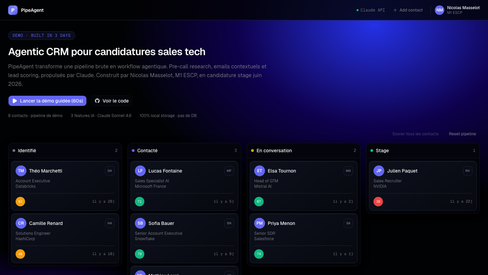

[](https://pipeagent.vercel.app)

# PipeAgent — Agentic CRM



PipeAgent est un CRM agentique conçu pour la recherche de stage en sales tech. Il combine une pipeline Kanban avec des features IA (Claude) pour gérer les contacts, préparer les appels, rédiger des emails personnalisés et prioriser les prospects par scoring.

## Features

- **Pipeline visuelle** — Kanban drag-and-drop avec persistance locale (localStorage)
- **Recherche pre-call IA** — Brief entreprise, profil contact, 3 angles de pitch et 3 questions à poser, générés par Claude
- **Emails contextuels** — Génération de cold emails, relances et follow-ups personnalisés selon le contact et la recherche disponible
- **Lead scoring** — Score 0-100 sur 3 axes (probabilité de réponse, fit profil, timing recrutement) avec scoring en lot

## Stack

- **Framework** — Next.js 14+ (App Router, TypeScript strict)
- **UI** — Tailwind CSS v4, shadcn/ui (preset Nova), Radix UI
- **Drag-and-drop** — @dnd-kit/core
- **IA** — Anthropic Claude (via proxy route serveur `/api/claude`)
- **Persistance** — localStorage (pas de base de données)
- **Notifications** — Sonner

## Run locally

```bash
git clone https://github.com/NicolasMasselot/pipeagent.git
cd pipeagent
npm install
cp .env.local.example .env.local
# Ajouter ta clé Anthropic dans .env.local :
# ANTHROPIC_API_KEY=sk-ant-...
npm run dev
```

Ouvre [http://localhost:3000](http://localhost:3000).

## Demo data

Tous les contacts sont fictifs et générés pour la démo. Aucune correspondance avec des personnes réelles. Un bouton "Reset pipeline" permet de restaurer le seed à tout moment.

